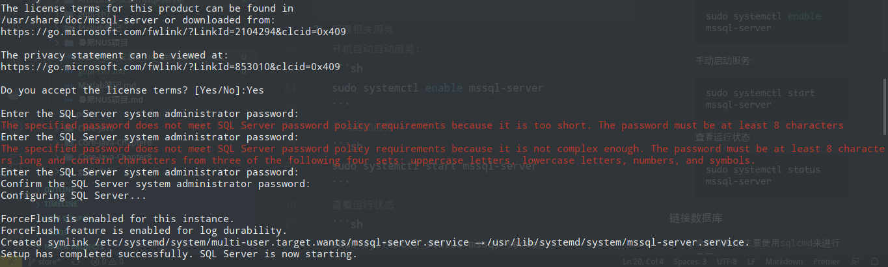
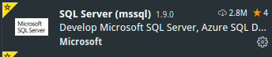
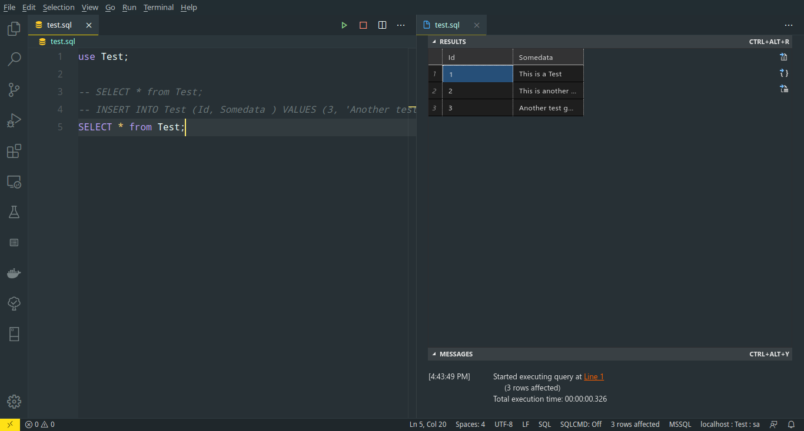
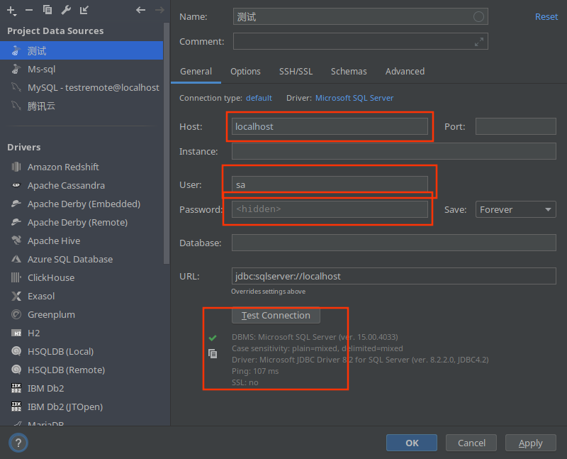

## 如何在ArchLinux中安装mssql-server
> 主要参考[youtue视频](https://www.youtube.com/watch?v=KnIjhVkO5rw)

### 依次安装`mssql-server`, `msodbcsql`, `mssql-tools`
   若使用`yay`作为包管理器则输入以下命令即可
   ```sh
   yay -S mssql-server msodbcsql mssql-tools
   ```

### 进行相关配置,如证书以及密码

1. 选择证书版本以及配置密码
   ```sh
   $ sudo /opt/mssql/bin/mssql-conf setup
   ```
   
   此处我们选择第二个证书(`2) Developer (free, no production use rights)`),并同意相关条款(`yes`),接着设置**符合规范**的管理员密码
   
<!-- more  -->
1. 配置相关服务
   开机自动启动服务:
   ```sh
   sudo systemctl enable mssql-server
   ```
   手动启动服务:
   ```sh
   sudo systemctl start mssql-server
   ```
   查看运行状态
   ```sh
   sudo systemctl status mssql-server
   ```

### 链接数据库

1. 命令行操作
   主要使用`sqlcmd`来进行登录
   ```sh
   sqlcm -U sa -P password
   ```
   默认用户名为`sa`, 密码为一开始设置的密码,输入后即可键入命令执行
2. 使用vscode拓展
   安装拓展`SQL Server(mssql)`
   
   `Ctrl + Shift + p`创建新的数据库连接,连接成功后即可编写脚本,并会在右侧显示输出
   
3. 使用`DataGrip`
   > 可能会提示没有相关驱动,点击下载即可
   
   添加新数据库,选择`Microsoft SQL Server`
   地址填写`localhost`,端口不用写
   用户名为`sa`
   密码为上述设置的密码,点击`Test connection`测试连接是否成功,确认成功后点击`OK`即可
   
   