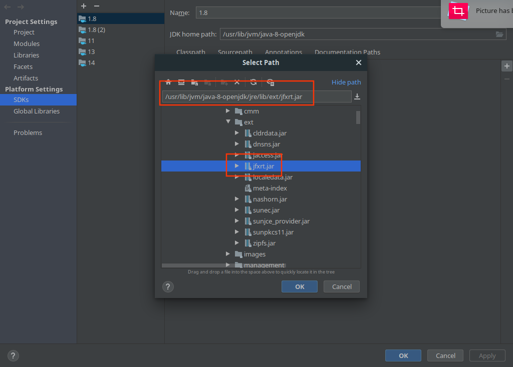
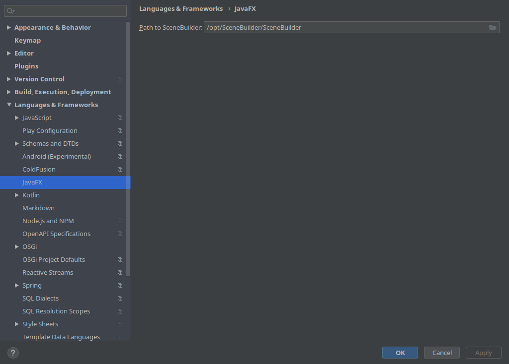
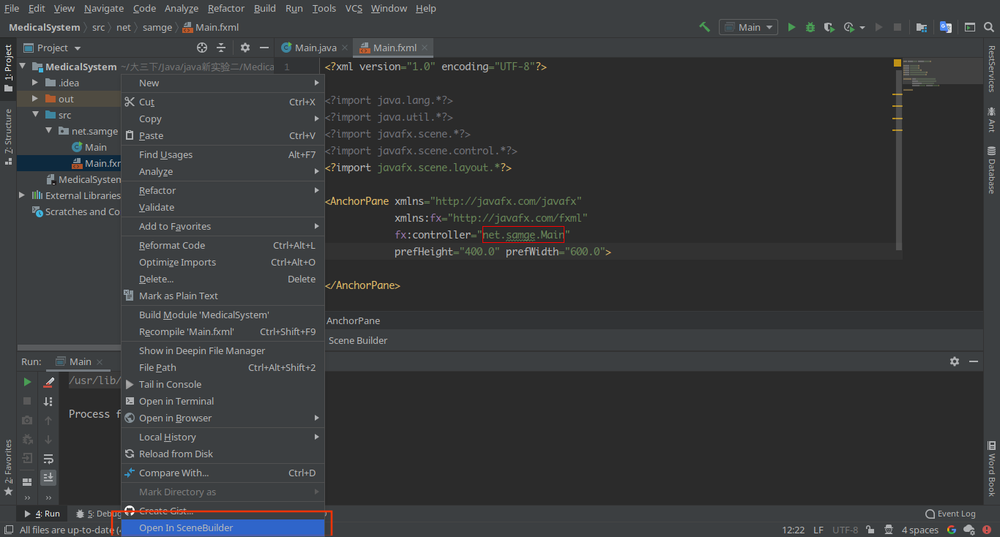

## 说明
基本信息:
- 系统: `manjaro-deepin`
- Java版本: `java-8-openjdk`
- javafx也是基于Java8的版本，scene-builder为Gluon的版本，也是基于Java8
- Intellij版本: `2020.1`
> 主要参考[在Linux/Ubuntu上配置开发JavaFx程序 (更新)](https://www.jianshu.com/p/8ced98d4f73c)


## 安装Javafx
一开始尝试过安装最新的Java13版本，但是遇到了各种问题，最终还是选择了Java8版本
如果使用`yay`作为包管理器的话通过以下命令进行安装(如果不是的话，建议尝试一下`yay`)
```sh
yay -S java8-openjfx
```
<!-- more  -->
## 安装javafx
在`aur`中同样有多个版本，此处选择了最近更新的Java8版本的Javafx
同样使用`yay`进行安装
```sh
yay -S javafx-scenebuilder
```

## 配置Intellij
### 配置`javafx`
创建新的工程，jdk选择8，依次选择`Project Structure -> SDKs -> 1.8(或者对应Java8版本的其他名字) -> Classpath`，点击右侧的加号，选择javafx的jar包位置，本机上为`/usr/lib/jvm/java-8-openjdk/jre/ext/jfxrt.jar`(只添加这一个即可)，具体位置不清楚的可以查看`PKGBUILD`文件(或者使用`yay -Ql packageName`)

使用以下代码进行基础测试
```java
package net.samge;

import javafx.application.Application;
import javafx.scene.Scene;
import javafx.scene.layout.StackPane;
import javafx.stage.Stage;
import javafx.scene.control.Label;
public class Main extends Application {

    public static void main(String[] args) {
	// write your code here
        launch(args);
    }

    @Override
    public void start(Stage primaryStage) {
        Label label = new Label("the first label");
        // 创建面板作为根节点
        StackPane rootNode=new StackPane();
        // 将label控件添加到根节点上
        rootNode.getChildren().add(label);
        // 创建场景对象，指定根节点对象和大小
        Scene scene=new Scene(rootNode,200,60);
        primaryStage.setTitle("Hello JavaFx");
        // 将场景添加到舞台中
        primaryStage.setScene(scene);
        // 显示舞台
        primaryStage.show();
    }
}
```
应该可以正常运行

### 配置scenebuilder
依次点击`File -> Setting -> Language & Framework -> JavaFx`，在输入框中选择`scenebuilder`的位置，本机上为`/opt/SceneBuilder/SceneBuilder`，不确定的话同样可以通过查看`PKGBUILD`查看具体安装位置再或者通过`yay -Ql packageName`也可以

新建一个`.fxml`文件(`右键 -> new -> fxml file`),再右键点击该文件,选择最下方的`Open In SceneBuilder`即可在`SceneBuilder`中打开`fxml`文件进行可视化编辑

在本机运行的时候,如果采用右键点击`fxml`文件进行可视化编辑产生了一些很奇怪的bug,比如窗口无法正常点击等等,建议直接单独打开`SceneBuilder`单独运行
用于编辑`fxml`文件
