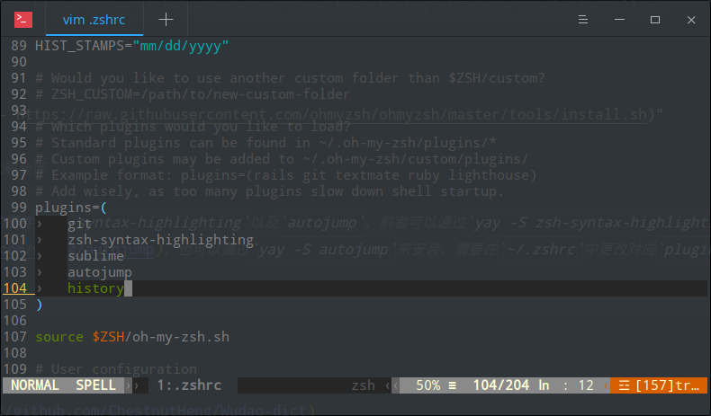
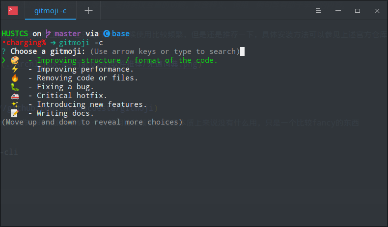
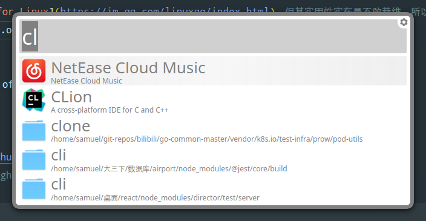

# 前言
从刚入大学起便陆陆续续尝试了各种Linux发行版本，最常见的当然是Ubuntu，以及这篇文章中所介绍的Arch(系)。最开始的尝试可以说只是小打小闹，虽然是以双系统的方式安装的，但是实际启动的次数屈指可数。在经历了一次Windows更新更炸之后，我便决定以尝试以Linux作为主力系统。从去年开始到现在满打满算差不多一年半的时间，我基本没有开启过Windows系统，只有在寻找以前的文件以及运行某些软件（如`pandownload`）时才会开启打开Windows或者开启Windows虚拟机。日常的学习以及代码编写基本没有不适感。所以个人感觉还是比较有说服力的。中途经历了一次从纯Arch转到Manjaro-Deepin的过程，由于本人的大多数代码文件都在github上保存，所以迁移起来也很很顺利，而deepin-dde也给了我很大的惊喜（虽然最近更新的V20个人不是很喜欢）。由于本人使用的manjaro-deepin在manjaro的官网已经没有了下载途径（其他地方似乎也找不到），并且官方也宣布近期不会进行适配，但总的来说，本文所推荐的软件对于Arch系乃至于所有的Linux发行版本应该都是适用的。
> 文中不会包含一些过于基础的软件包，如npm, git等。既然都来Linux，相信这些基本的工具应该不需要多说（并且有时系统会自带这些软件包，尤其是`Manjaro`发行版本）

<!-- more -->

# 正文

## 终端相关
### yay包管理器
[仓库链接](https://github.com/Jguer/yay)
`pacman`无法从`AUR`安装，而`yaourt`不再维护，所以我们使用`yay`
```sh
sudo pacman -S yay
```
即可安装，之后软件的安装均使用`yay`进行，基本都是一键安装
需要更新系统软件包时也非常简单
输入
```sh
yay
```
即可

### zsh & oh-my-zsh
[仓库链接](https://github.com/ohmyzsh/ohmyzsh)
> 印象中安装`oh-my-zsh`的过程会自动安装`zsh`，如果没有自动安装可以通过`yay -S zsh`来安装

**via curl**
```sh
sh -c "$(curl -fsSL https://raw.githubusercontent.com/ohmyzsh/ohmyzsh/master/tools/install.sh)"
```
**via wget**
```sh
sh -c "$(wget -O- https://raw.githubusercontent.com/ohmyzsh/ohmyzsh/master/tools/install.sh)"
```
更多配置请访问上述代码仓库

同时建议安装zsh的插件`zsh-syntax-highlighting`以及`autojump`。前者可以通过`yay -S zsh-syntax-highlighting`来安装，后者的[仓库](https://github.com/wting/autojump)，也可以通过`yay -S autojump`来安装，需要在`~/.zshrc`中更改对应`plugin`字段，如下图所示



> 个人使用的主题为`spaceship`([官方仓库](https://github.com/denysdovhan/spaceship-prompt))，有12k star，应该还是比较受欢迎的


### 无道词典
[仓库链接](https://github.com/ChestnutHeng/Wudao-dict)
> 无道词典，是一个简洁优雅的有道词典命令行版本。支持英汉互查的功能，包含释义、词组、例句等有助于学习的内容。

这个工具算是早期折腾的时候使用的工具，也只是开始的时候使用比较频繁，但是还是推荐一下，具体安装方法可以参见上述官方仓库
运行截图如下:


### gitmoji
[仓库链接](https://github.com/carloscuesta/gitmoji)
用于在git中执行commit操作的时候加入表情，个人使用比较频繁，但是本质上来说没有什么用，只是一个比较fancy的东西
```sh
npm i -g gitmoji-cli
```
即可安装
运行时如下图所示


## 科学上网
主要针对ss/ssr/v2ray
主要使用的是`electron-ssr`以及`Qv2ray`。其中`electron-ssr`已经不再维护，但是可以正常工作。可以通过AUR安装
```sh
yay -S electron-ssr
```
而Qv2ray的仓库[如下](https://github.com/Qv2ray/Qv2ray)。
> 使用 Qt 框架的跨平台 V2Ray 客户端。支持 Windows, Linux, macOS。插件系统支持 **SSR / Trojan / Trojan-Go / NaiveProxy**

```sh
yay -S Qv2ray
```

## 编程相关
### jetbrains全家桶
如果有教育邮箱并[申请了对应证书](https://sales.jetbrains.com/hc/zh-cn/articles/207154369-%E5%AD%A6%E7%94%9F%E6%8E%88%E6%9D%83%E7%94%B3%E8%AF%B7%E6%96%B9%E5%BC%8F)可以使用professional/ultimate版本，否则只能使用community版本。这些软件基本上是对应语言的最佳IDE
- `Clion` C/C++
  ```sh
  yay -S clion
  ```

- `PyCharm` python
  ```sh
  yay -S pycharm-community-edition
  ```
  如果有教育邮箱并申请了相关的证书
  ```sh
  yay -S pycharm-professional
  ```

- `GoLand` golang
  ```
  yay -S goland
  ```

- `IntelliJ` Java
  ```sh
  yay -S intellij-idea-community-edition
  ```
  或是专业版
  ```sh
  yay -S intellij-idea-ultimate-edition
  ```
- `DataGrip` database
  ```sh
  yay -S datagrip
  ```
- `WebStorm` frontend
  ```sh
  yay -S WebStorm
  ```

### 安卓开发
`android-studio`
```sh
yay -S android-studio
```

### VsCode
不必多说，万能编辑器
```sh
yay -S visual-studio-code-bin
```

### Markdown/LaTex
Markdown一般来说使用`Typora`或是`VsCode`(需要安装对应插件)，而Latex确实没有找到很喜欢的编辑器，所以就用`VsCode`配合`LaTex WorkShop`插件，体验还是不错的。其中`LaTex`还需要安装额外的软件包，一般来说安装`texlive-most`以及`texlive-lang`就足够了(`yay -S texlive-lang texlive-most`)。更多关于在arch上配置`LaTex`的细节可以参考[wiki](https://wiki.archlinux.org/index.php/TeX_Live)

### Anaconda
python环境管理工具


## 日常工具
### WPS
虽然没有office三件套，但是我们有WPS！
```sh
yay -S wps-office
```
即可安装，包括文档，PowerPoint，表格以及pdf，基本可以满足平常的需求

### Motrix
[仓库链接](https://github.com/agalwood/Motrix)
> Motrix 是一款全能的下载工具，支持下载 HTTP、FTP、BT、磁力链等资源。


下载工具，强烈推荐！！！好看又好用，通过chrome下载很慢的文件使用`Motrix`下载基本可以提速5到10倍，甚至更高(基于`aria2`，磁力链接体验不佳)，非常离谱。用就完事了！
```sh
yay -S motrix
```

### 百度网盘
百度网盘官方支持，虽然失去了`pandownload`，但是至少官方的能用(自我安慰)。
```sh
yay -S baidunetdisk-bin
```
个人使用的时候出现了无法登录的问题，尝试了**使用手机号登录**，以及`rm ~/baidunetdisk`之后均无效，只有通过命令行启动的才能正常登录。但是好在使用频率不搞，也就没有继续钻下去，勉强能用

### TIM/QQ
虽然腾讯官方推出了 [QQ for Linux](https://im.qq.com/linuxqq/index.html)，但其实用性实在是不敢恭维。所以还是继续使用基于wine的解决方案。这里使用的是`deepin.com.qq.office`也即TIM

```sh
yay -S deepin.com.qq.office
```

### Albert Launcher
[仓库链接](https://github.com/albertlauncher/albert)
> 本人体验了多款类似功能的软件，如`cerebro`、`synapse`，最终还是选择了`albert`
提供类似于Mac上的Spotlight的体验（当然肯定比不上）
实际运行如下:

可以提供
- 文件检索
- 程序启动
- 算式计算

等功能
```sh
yay -S albert
```
### 网易云音乐
不必多说
```
yay -S netease-cloud-music
```

### Telegram
同样是通过yay安装
```sh
yay -S telegram-desktop
```
> 需要配置一下代理

### 虚拟机
首选VirtualBox
```
yay -S virtualbox virtualbox-ext-oracle virtualbox-guest-iso
```
有时候会遇到必须使用Windows的情况，所以可以安装一个Windows虚拟机以便不时之需。


### 截图工具
一般deepin自带的截图工具就够用了。非deepin用户可以尝试[flameshot](https://github.com/lupoDharkael/flameshot)。之前在纯Arch下体验很好。
```
yay -S flameshot-git
```

# 安装/使用遇到问题如何解决？
一般来说有以下几种方式(不分先后)
- Google
- 查看对应aur页面，可能会有相关讨论
- 查看对应仓库issue页面，如果是在找不到解决方法可以提issue
- 查看对应arch wiki页面（如果有的话）

也可以尝试在我的[另一篇博客](https://hustergs.github.io/archives/d4f342f.html)中找找看，也许会有惊喜。
当然也欢迎在本文下方留言。
