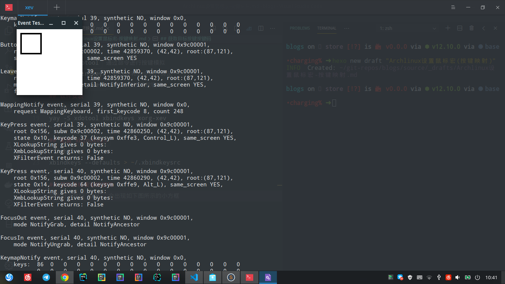
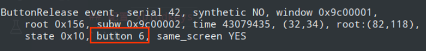

> 原意是想要给新买的鼠标设置按键映射，将侧键映射到桌面切换(super+left/right)，由于罗技官方的Logitech Option 并没有Linux版本，所以需要使用第三方软件，一开始找到了名为[piper](https://github.com/libratbag/piper)的软件可以为[支持列表](https://github.com/libratbag/libratbag/tree/master/data/devices)中的鼠标设置按键/功能映射,最终发发现我的这款鼠标无法设置宏，遂作罢。之后又发现了`xdotool`以及`xbindkeys`可以实现更加通用的按键映射，自然也包括鼠标按键，通过这种方法间接实现了宏的设置

主要参考[Linux下的鼠标宏映射实现](https://www.imwxz.com/guide/128.html)

## 基本信息
系统: `manjaro-deepin`
鼠标: `Logitech M590`
需要的软件: 
    - `xdotool` 通过命令进行按键模拟
    - `xbindkeys` 将按键和命令进行绑定
    - `xorg-xev` 获得特定按键按键码

<!-- more -->
## 软件安装
```sh
yay -S xdotool xbindkeys xorg-xev
```
## 配置`xbindkeys`
```sh
xbindkeys --defaults > ~/.xbindkeysrc
```
## 获取目标按键按键码
命令行下执行`xev`，会出现如下图所示的小方框

将鼠标移动到黑色方框内，待命令行输出稳定之后，按下目标按键(如侧键)，然后在输出中寻找如下图所示的Button字段,记下对应的数字

## 编辑配置文件
编辑刚刚创建的配置文件，加上以下配置
```
"xdotool key super+Left"
b:8

"xdotool key super+Right"
b:9
```
便可将两个侧键映射为桌面切换(或者其他的指定按键)，其中数字即为刚刚通过`xev`查询到的目标按键对应的数字,引号的内容为xdotool的命令,按键名称可以参考[这里](https://gitlab.com/cunidev/gestures/-/wikis/xdotool-list-of-key-codes)

## 测试
重启xbindkey程序
```sh
killall xbindkeys && xbindkeys
```
测试目标按键是否生效

> 以上步骤在重启之后会失效，所以需要将`xbindkeys`加入开机脚本中，此处不再赘述
通过`xbindkey`和`xdotool`能够做的远不止如此,xdotool似乎还可以监听其他更加复杂的事件