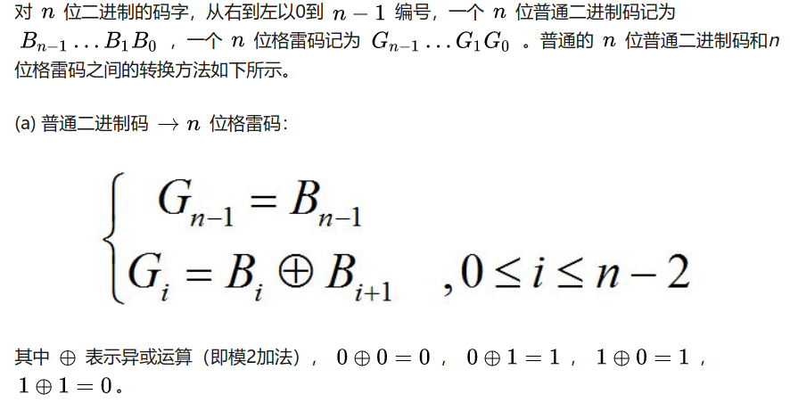
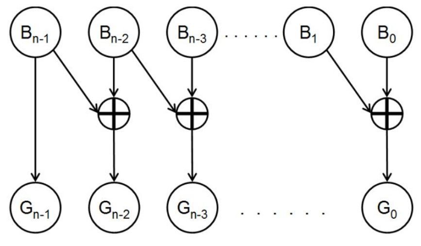
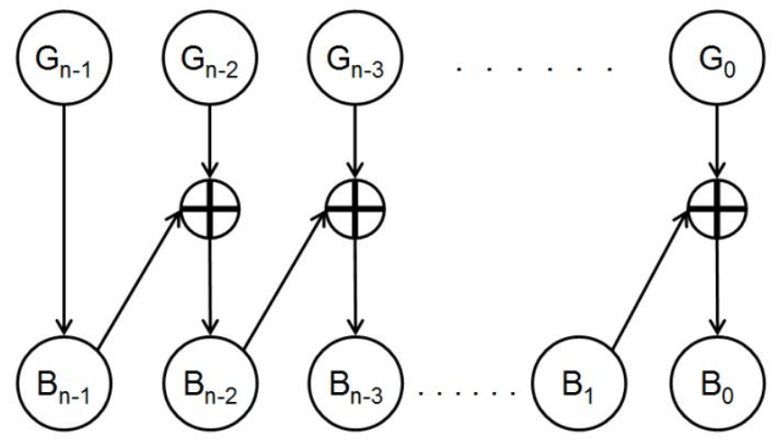

# 第一章

## 基本知识

1. 十进制小数转二进制 => 求二进制取m位小数的时候，求出m+1位，然后对最低位进行0舍1入处理 P8

2. 将符号位和数值一起编码 => 机器码 => 原码、反码、补码 P10

   原码 简单的符号位和数值的组合，问题在于有两个0

   反码 如果是负数，数值位取反

   补码 负数，数值位取反之后在最低位加一 => 小数也是一样

3. 十进制数的二进制编码(BCD) => 8421、2421、余三 P13

   8421 => 简单的去掉大于等于10的值，在转化的时候要注意固定是4位对应十进制的一位

   2421 => 权值依次为 2、4、2、1 所以不具备单值性，不能出现**0101~1010**但是好处在于它是**对9的自补代码**所以可以很方便的将减法转化为加法。同时也可以利用这个特性来记忆，即0～4与8421码相同，5～9通过取反得到，注意是对9取反，不是对10

   余3码 => 为了结合8421以及2421的特性，通过将8421码加3得到。是一种**无权码**，也是**对9的自补代码**，但是需要进行修正 两个余3码的10进制数相加的时候，**如果有进位，结果加3,没有进位，结果减3**，将余3码转化为十进制，可以先减去3,即0011,然后就变为了正常的二进制数 =>     

   >  不是很懂这个地方所说的**结果**是指的什么

   注意以上的三种编码在转化为10进制的时候，都是每4位对应一个十进制位

<!--more-->

4. 格雷码 特点：**任意两个相邻的数，他们的格雷码只有一位不同** => 为了解决二进制数加一或者减一的时候由于有多个位发生变化，不同的位之间的变化速度可能不一致，因而产生的中间状态可能导致错误。比如`01`加1变为`10`，两位都发生了变化。 P15
    
   <!-- </img> -->

    
    

<!-- </img>

</img> -->

> 真正传输的时候用的是格雷码吗？还是说只是作为一种检测的方法？

1. 奇偶校验码 P15

   包括信息位和校验位，奇/偶校验分别表示加上校验位之后就会**使代码中的1的数目为奇/偶**，或者说，如果信息位中的1的个数是偶数，那么奇校验的校验位就是1，反之亦然。检测是否出错的时候，是检测包括校验位在内的1的个数是否是先前约定好的校验方法的位数。只能发现**单错**，不能发现双错，并且不能纠错，但是非常容易实现

   > 格雷码可以纠错吗？

# 第二章

## 逻辑代数基础

1. 比较重要的几个公式 P19
   公理：

   分配率 %20=%20(A%20+%20B)%20\cdot(A+C))

   ​	  %20=%20A\cdot%20B+A\cdot%20C)

   在化简的时候很有用，尤其是第一个公式反着用

   互补率

   存在**唯一的**使得  

   其实很少用到，但是在一些很刁钻的证明的时候会用到这里的**唯一性**

2. 两个逻辑函数相等，即对于所有可能的变量的输入，两个函数的真值都相同 P22

   * 枚举
   * 化简

3. 描述逻辑函数 => 逻辑表达式、真值表、卡诺图 P23

   逻辑表达式 字面意思

   真值表 字面意思 一般为了不发生遗漏，按照二进制数递增的顺序写

   卡诺图 这一节没有讲，所以以后再说

4. 逻辑代数的基本定理 P24

   这里有很多的公式都比较重要

   幂等性 很好记，不经常用 

    

   

   定理3 很好用 经常用 

    

   %20=%20A)

   定理4 很好用 经常用 

   

   %20=%20A%20\cdot%20B)

   定理7 第二个可能会用到，第一个很显然 

    

   %20\cdot%20(A%20+%20\overline{B})%20=%20A)

   定理8 有可能会用到第一个，如果真的遇到第二个那也没办法

   

   %20\cdot%20(\overline{A}%20+%20C)\cdot(B+C)%20=%20(A%20+B)\cdot%20(\overline{A}%20+C))

   

5. 重要规则 P25

   带入规则 字面意思

   反演规则 比较重要 经常用到 需要注意的地方就是转化的时候要保持原来式子的计算顺序

   对偶规则 实际上好像用到的不是很多   可以使定理、公式的证明减少一半

6. 由于异或、与或等等门的性能更高，所以常常将某一个逻辑式子转化为**与非**、**或非**逻辑，基本原理就是与非和或非可以表示基本的与、或、非逻辑。 P27

   与非：

   与 

   或 

   非 

   需要记住的基本上是第三个式子，其他的都可以根据第三个推出来

   

   或非：

   与 

   或 

   非 

   也是要记住第三个

   

   与或非逻辑：

   实际上很少用到，并且不划算，所以就不说了

   

   异或逻辑和同或：

   异或：

   异或逻辑原本是两个变量的逻辑关系，但是实际上可以用于多个变量，但是意义就变得不是那么清晰了

    表示当A、B不同的时候F才为1，因此称为异或

   > **注意**:这个性质对于多个变量的异或是不成立的，也就是说三个变量的异或并不是说当三个变量相同的时候F就是0,其他时候就是1。

   多个变量异或的时候，如果有奇数个变量的值是1,那么输出就是1,否则为0

   

   同或：

    A B相同的时候输出1，其余时候输出0，其他特性跟异或差不多，就不赘述了

   多个变量异或的时候，如果有奇数个变量的值是0,那么输出就是0,否则为1

   异或和同或在两个变量的时候具有非的关系，即

    但是注意，这个性质只能用于两个变量的时候。也是因为这个性质，所以我么一般不会使用同或，大部分都是使用异或(我猜的)

   > 实际上多变量的时候，异或和同或也是有一定关系的，即如果变量的个数是偶数，那么异或和同或就相反，如果变量的个数是奇数，那么异或和同或就相同，但是实际上用到的比较少(没见过)

7. 逻辑表达式的 基本形式 标准形式 以及其相互转换 P29

   基本形式 "与或"、“或与”

   

   标准形式 “标准与或”、“标准或与” => 建立在**最大项**、**最小项**的基础之上

   注意最小项的原变量、反变量和最大项的相反，前者是用1来表示原变量，0来表示反变量，后者相反

   两者之间存在以下关系

   

   如何将基本形式转化为标准形式？

   * 利用 ) 以及 (X%20+%20Y)) 得到标准与或和标准或与

   * 利用真值表 真值表的`1`即代表最小项，`0`代表最大项，如在分别取101的时候是1,所以包含有,在分别取111的时候是0,所以包含，注意这个时候的最大项和最小项的取法都是一样的，取值是多少就是多少，不是相反的关系

     > 同时我们也可以很容易的得到，和是互补的 换句话说，如果得到了一个，可以很容易的得到另外一个，在求标准或与的时候，可以先对整个式子求反，然后求出他的标准与或，然后再求反就可以得到标准或与(其实挺麻烦的，当我没说)

   

8. 逻辑函数化简 P34

   重点在与或表达式的化简

   玄学化简：

   基本上就是用之前提到的重要公理以及重要公式来化简，再加一个配项法

   难度其实不是很大，注意在化简或与表达式的时候可以使用两次对偶的办法，就是先求对偶，然后得到最简与或，然后再对偶一次，注意，**对偶只是改变或和与，并不取反**

   

   卡诺图化简：

   

   根据真值将不同的变量组合写在一张表上，注意写的时候要保证相邻的两项之间只有一个位不同，即`01`之后是`11`不是`10`。如果变量数超过了5个，那么也不强求，一般不会遇到这种情况

   卡诺图的特点：

   1. n个变量的卡诺图由个小方格组成，每个小方格代表一个最小项
   2. 相邻、相对、**相重**位置上的小方格代表的最小项就是相邻最小项 => 相对是指边界情况，相重是变量数超过5个的情况，一般不会遇到，遇到就完蛋

   卡诺图的原理就是相邻的最小项可以通过合并

   如何画卡诺圈？

   画多了就知道了

   如果求的过程之中遇到了或与表达式，一般都是取一次反，让其变为与或，或者针对卡诺图上的`0`来化简之后在取反

   卡诺图受变量个数的影响非常之大，一般来说只能处理1~4变量的情况

# 第四章

## 组合逻辑电路

1. 组合逻辑电路就是单纯的逻辑器件的连接，非常直观、直接，其中**信号是单向传播的，不存在任何反馈电路** P97

2. 根据逻辑电路图写出输出函数表达式，没什么好说的，根据题目需要来决定是否要化简 P98

3. 组合逻辑电路设计  P100

   基本过程：

   * 真值表法
     * 根据题目要求，假设变量，写出真值表
     * 画出卡诺图
     * 得到最简表达式 => 电路
     * 有时候还需要根据题目限制用的门的类型进行转换
   * 玄学设计法
     * 对设计要求的**分析、理解**，直接写出逻辑表达式

4. 可能遇到的问题 P104

   * 包含无关项的组合逻辑电路设计，有时候有一些输入根本不会出现，或者他的结果我们不在乎，我们就可以尽量**利用**这种情况，在卡诺图中用`d`来表示，根据需要将其转化为`1`或者`0`，使表达式得到进一步的化简

   

   * 多输出的函数的组合逻辑设计

     有时候电路有多个输出，但是如果直接用卡诺图**分别**得到各个输出的最简表达式，很有可能得到的电路**并不一定**是最简单的，有时候多个函数之间的一些门的公用可以使电路进一步化简，实际上就是让多个卡诺图之间有相同的圈，公用一些门 但是实际上也可以说是玄学吧

   > 注意，在遇到波浪型的真值表的时候，要注意是或者逻辑。直接画圈基本不可能

   

   * 没有反变量提供的组合逻辑电路设计

     基本上电路设计都只会提供正变量，不会同时提供和作为输入，一般来说需要用到反变量的时候就直接取反就好了，但是实际上是有一点不划算的。所以经常将其转化为**与或**或者**或与**门来进一步化简

   > 但是感觉似乎并没有什么系统的办法？

   * 尽量使用异或门，对设计对象的编码不同可能会极大的影响最终式子的复杂程度，但是书上似乎也没有提供什么有效的方法

   

5. 险象的产生 P112

   如果把一个电路门的状态翻转的时间记为那么很容易就会发现一个电路有**可能**由于经过的门的数量不同而导致出现一些中间的**错误状态**，如果运气够好，中间的状态和预期状态一样就是**非临界竞争**，如果不一样就是**临界竞争**。

   如果错误的脉冲是`0`或者说是负脉冲，就被称为"0"型险象，反之亦然

   

6. 险象的判断 P113

   如果某个变量同时以原变量和反变量的形式出现在函数表达式之中，并且在一定条件下函数表达式可以化简为或者的形式的话，就有可能发生险象。如果是前者，可能发生的就是"0"型险象，后者就是“1”型险象

   > 注意判断的时候不能先化简函数表达式

   1. 通过带入其他变量的不同的值来得到

   2. 卡诺图，如果两个圈相切，那么相切的部分就会产生险象

      > 注意这个地方画的圈就是单纯把原来的表达式画到卡诺图里面，没有化简的步骤，原来是什么就是什么

   似乎这种判断方法只能判断**有可能**会发生什么险象，并不能准确判断是否发生，如果真的要判断的话，似乎要用到实际的电路图，然后画那种时间图

7. 险象的消除

   1. 增加冗余项
   2. 增加惯性延时环节
   3. 选通法

# 第三章

## 集成门电路与触发器

​       不写了,复习不完要挂科了qaq

真的要挂科了....