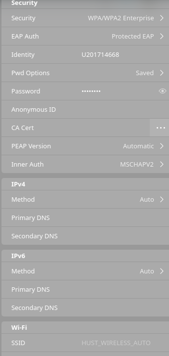
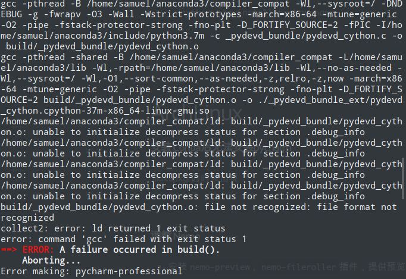

# Python


### 多个conda环境的 Jupyter lab 配置

```shell
conda activate envName
// 切换到对应的环境

pip install ipykernel
// 安装 ipykernel

python -m ipykernel install --user --name  envName --display-name "whatever you like"
// envName 是你的环境名字，不能更改
// 后面的字符串是你在jupyter 之中想要显示的环境的名字，可以根据情况更改
如果出现某些原因导致之前的conda环境不存在了，可以在~/.local/jupyter/kernel中删除原来的kernel
```

### conda 基本操作

```shell
conda create -n name python=version # version为3.6 / 2.7等版本号

conda update --all # 更新所有包

conda config --set changeps1 False # 取消在prompt中显示当前环境
```

### 多环境pip安装包

直接到想要安装包的环境的`/bin`下,运行

```shell
./python pip install packagename
```
<!--more-->


### 暂时切换默认Python为`/usr/bin/python`而不是`~/anconda3/bin/python`

注释掉`.zshrc`(`.bashrc`)中`conda init部分`

或者将`export PATH="/home/user/anaconda3/bin:$PATH"`改为`export PATH="$PATH:/home/user/anaconda3/bin"`(好像没用？)

使得系统默认的`Python`先被找到

[参考](https://stackoverflow.com/questions/24664435/use-default-python-rather-than-anaconda-installation-when-called-from-the-termin)

### pip换源

```shell
# 临时切换
pip install -i https://pypi.tuna.tsinghua.edu.cn/simple numpy
# 永久切换
# edit ~/.pip/pip.conf (create one if not exist)
# 添加为
 [global]
 index-url = https://pypi.tuna.tsinghua.edu.cn/simple
```


# ArchLinux

## 系统

### 搜狗拼音占用过高CPU

`fcitx -r`

### 垃圾文件无法删除

直接进入到trash对应的实际目录`~/.local/share/Trash`中进行删除即可(注意大小写)

### Deepin-wine

设置特定软件`DPI`等等

`WINEPREFIX=~/.deepinwine/Deepin-TIM deepin-wine winecfg`

`prefix`换成特定的软件位置

### 解压出现中文乱码

使用`unar`即可

### HUST_WIRELESS_AUTO 

修改`/etc/NetworkManager/system-connections/`中对应的WiFi名称，在`security`添加`auth-alg=open`


<!--  -->


[参考]('https://askubuntu.com/questions/279762/how-to-connect-to-wpa2-peap-mschapv2-enterprise-wifi-networks-that-dont-use-a-c')

### 安装WPS之后mime混乱

删除`mime`文件，更新`mime`

```shell
sudo rm /usr/share/mime/packages/wps* # 删除所有wps的.xml文件 
sudo update-mime-database /usr/share/mime # 更新mime
```

### Word文档粘贴图片乱跑

全文改为单倍行距

### Java 版本管理

使用`archlinux-java`命令进行管理

### VirtualBox两个虚拟机Ip相同

> 主要是在大数据导论课程中需要在虚拟机中运行`spark`所以就需要两个`slave`，并且要求ip不同

在命令行中输入以下

`VBoxManage modifyvm "SparkSlave1" --natnet1 "10.14.126.33"`

`VBoxManage modifyvm "SparkSlave2" --natnet1 "10.14.126.34"`

其中`natnet1`的参数为所要设置的ip地址

### Albert Calculator插件无法使用

安装`muparser`之后重新安装`albert`

> 顺便推荐一波`Albert`

### LInux 下matlab语言设置

由于`matlab`在Linux下是通过`LANG`环境变量来决定语言的，而不像其他操作系统中直接通过`preference`提供了设置的选项，所以只需要在启动的时候`export`相应的环境变量值即可，如

```shell
export LANG=en_US.UTF-8; {MATLAB}/bin/matlab
# 中文为zh_CN.UTF-8
```


### 安装 Conda后无法安装pycharm

`makepkg`的时候出现



<!--  -->

由于`PKGBUILD`文件中写的是`python3`，默认使用的`conda`中的`python3`

将`build()` 中的 `/usr/bin/python3 helpers/pydev/setup_cython.py build_ext --build-temp build --build-lib .`的`python3`改为`/usr/bin/python3`即可

> 后来发现可能是`conda`安装之后修改了`PATH`导致首选链接库变成了`conda`的，更简单的解决方法就是将`.zshrc`中`conda`初始化的部分注释掉，重启shell，然后再安装`pycharm`

### 调教 Nemo

* 安装`nemo-preview`, `nemo-fileroller`插件，提供预览和 解/压缩 的功能

* 通过在`~/.local/share/nemo/actions` 编写 `.nemo_action`文件来扩充右键菜单

  `code.nemo_action`

  ```
  [Nemo Action]
  Name=Open in Code
  Comment=open current path in visual studio code
  Exec=code %P
  Selection=None
  Extensions=any;
  Icon-Name=notebook
  ```

  

  `code_folder.nemo_action`

  ```
  [Nemo Action]
  Name=Open in Code
  Comment=open selected folder in visual studio code
  Exec=code %F
  Selection=1
  Extensions=any;
  Icon-Name=notebook
  ```

  **注意**:`Icon-Name` 可以在安装的各种`Icon-theme`所在文件夹(我的在`/usr/share/icons/Numix/scalable/actions`)中找到`action`文件夹，使用其中的图标(去掉拓展名)

  而在`~/.local/share/nemo/actions`，点击出现的提示`More Info` 会打开`.nemo_action`文件的基本编写文档

### 添加开机自启动任务

在`/etc/systemd/system`中添加`rc-local.service`内容为

```
[Unit]
Description=/etc/rc.local Compatibility

[Service]
Type=oneshot
ExecStart=/etc/rc.local
TimeoutSec=0
StandardInput=tty
RemainAfterExit=yes

[Install]
WantedBy=multi-user.target

```

然后编写`/etc/rc.local`， 记得要加上`#!/bin/bash`否则会出现format错误导致无法执行，似乎也要添加执行权限`chmod u+x /etc/rc.local`

```bash
#!/bin/bash
your commands

```

然后在系统服务中添加rc-local.service

> 这一项原本是为了解决 pcspkr模块所带来的beep的声音，但是使用了各种方法都不行，最后用这种办法解决了，就是在`/etc/rc.local`中添加`sudo rmmod pcspkr`语句，开机执行

一般的想要自启动软件可以简单的将`/usr/share/applications/autostart_application.desktop`复制到`~/.config/autostart`文件夹即可,有时候使用软件提供的开机自启动选项并不好使

### Wallpaper

默认的用户添加的wallpaper需要放在`.cinnamon/background`

> 好像没有什么卵用

## 字体

添加完字体之后`fc-cache -fv`刷新字体缓存(或者使用`fc-cache -rv` 强制刷新)

### 解决终端无法正常显示表情(gitmoji)

在[google-noto-font]('https://www.google.com/get/noto/') 下载`Noto Color Emoji`安装即可

### 解决Typora中的emoji表情为黑白

安装`EmojiOne`字体

`yay -S ttf-emojione`

修改typora默认字体`~/.config/Typora/conf/conf.user.json`

将`standard`字体改为`EmojiOne`

重启Typora，即可正常显示彩色表情

> 注意不要把四个(`standard`, `serif`, `sanSerif`, 'monospace')全部改了，似乎某一更改之后会导致源码模式下左侧的行数也变为表情。

上述方法失败，由于aur中移除了`ttf-emojione`

安装`ttf-joypixels`之后将字体更改为`Noto Color Emoji`即可

### Manjaro-deepin中文乱码

安装字体`sudo pacman -S wqy-microhei`

## 硬件

`glxinfo -B`

获得3D hardware信息,可以查看当前使用的显卡等等

安装`inxi`来获得所有硬件信息

`xrandr --listproviders`

check the list of attached graphic drivers:

`glxinfo | grep "OpenGL renderer"`


# Git

### 解决`git add`等命令的中文乱码

终端输入 `git config --global core.quotepath false` 

原理:

> Commands that output paths (e.g. *ls-files*, *diff*), will quote "unusual" characters in the pathname by enclosing the pathname in double-quotes and escaping those characters with backslashes in the same way C escapes control characters (e.g. `\t` for TAB, `\n` for LF, `\\` for backslash) or bytes with values larger than 0x80 (e.g. octal `\302\265` for "micro" in UTF-8). If this variable is set to false, bytes higher than 0x80 are not considered "unusual" any more. Double-quotes, backslash and control characters are always escaped regardless of the setting of this variable. A simple space character is not considered "unusual". Many commands can output pathnames completely verbatim using the `-z`option. The default value is true.

>  摘自[git-scm](<https://git-scm.com/docs/git-config#Documentation/git-config.txt-corequotePath>)

### 解决`.gitignore`文件修改后git继续跟踪更改

如果项目一开始的时候就没有`.gitignore`文件的话,那么一旦git对文件进行跟踪,再添加到`.gitinore`就没有效果了

```shell
git rm --cached <path to file>

```

如果是文件夹的话加上`-r`参数

可以使用`git check-ignore`来检查`.gitignore`文件的编写是否正确

### 解决`git clone`速度慢

1. 挂代理

   `git config --global http(s).proxy xxxxx`

2. 我也不知道叫什么,但是的确有效

   `git config --global http.postBuffer 524288000`

> 用`git config --global -l`查看当前`git`配置

### fork之后想要更新

[参考](https://digitaldrummerj.me/git-syncing-fork-with-original-repo/)

```sh
git remote add upstream https://github.com/[Original Owner Username]/[Original Repository].git
git fetch upstream
git checkout master
git merge upstream/master
git push
```


### 解决git clone 需要输入密码

似乎是因为最近的更新，如果是已经克隆的仓库，请在`.git/config`中，将`url`一项，由`http`改为`ssh`

```
https://github.com/WEMP/project-slideshow.git 
到
git@github.com:WEMP/project-slideshow.git

```

# Sublime

### 安装Package  Control,解决中文乱码问题

[Package Control](https://packagecontrol.io/installation)

1. 输入命令安装
2. 下载后放到指定的位置

`Ctrl + Shift + P` 打开命令窗口

输入`install`, 选择`Package Control: Install Package`

输入`ConvertToUTF8`

> 安装后可能打开文件的时候会提示你要安装一个叫做`codecs33`的包,安装就好了,然后可能第一次安装包管理器的时候,更新特别慢 ==> Preferences: Package Control sublime Settings - User ==> 添加一行"channels"字段：

```json
"channels":
[
	"https://raw.githubusercontent.com/wilon/sublime/master/download/channel_v3.json"
],

```


# Qt

### 解决GTK桌面下Qt程序一些细节无法正常显示的问题

对于`qt4`

`/usr/bin/qtconfig-qt4 ` 选择`GTK+`

对于`qt5`

在`/etc/environment`中添加 `QT_QPA_PLATFORMTHEME=gtk2`


## npm
### nvm install 慢

`export NVM_NODEJS_ORG_MIRROR=http://npm.taobao.org/mirrors/node`

### 安装electron慢
`export ELECTRON_MIRROR=https://cdn.npm.taobao.org/dist/electron/`